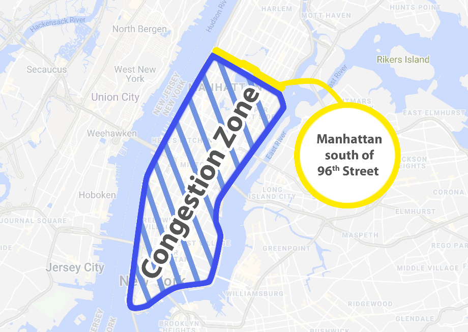

# NYC Taxi Fare Prediction

Machine learning project for analyzing and predicting NYC Yellow Taxi fares using 2023 trip data.



## Project Overview

This project performs comprehensive analysis of 34 million NYC Yellow Taxi trips from 2023, with the goal of building a fare prediction model. The pipeline includes data cleaning, exploratory analysis, feature engineering, and deep learning model training.

## Dataset

**Source**: [NYC TLC Trip Record Data](https://www.nyc.gov/site/tlc/about/tlc-trip-record-data.page)

- **Period**: 2023 (full year)
- **Records**: 34,009,543 trips (after outlier removal)
- **Raw Size**: 3.7GB CSV
- **Processed Size**: 1.2GB (train/val/test splits)
- **Target Variable**: `fare_amount` (metered base fare)

### Key Statistics
- **Mean fare**: $16.78
- **Median fare**: $12.80
- **Fare-distance correlation**: 0.954
- **Manhattan pickups**: 90% of all trips

## Project Structure

```
NYC-Taxi/
├── data/
│   ├── raw/                          # Original CSV (3.7GB)
│   ├── processed/                    # Train/val/test splits (1.2GB)
│   │   ├── train.parquet             # Training data (572MB)
│   │   ├── val.parquet               # Validation data (98MB)
│   │   └── test.parquet              # Test data (98MB)
│   ├── features/                     # Engineered features
│   │   └── engineered_features.parquet (572MB)
│   └── lookups/                      # Reference tables (taxi zones)
├── scripts/
│   ├── data_processing_pipeline.py   # ETL pipeline (DuckDB + Polars)
│   ├── data_loader.py                # TensorFlow data pipeline
│   ├── model.py                      # Neural network training
│   └── query_db.py                   # Database query utility
├── models/
│   ├── taxi_fare_model.keras         # Trained model (974KB)
│   └── normalizer.pkl                # Feature normalizer
├── taxi_data.db                      # DuckDB database (420MB)
├── data_quality_report.csv           # Validation results
└── zones_statistics.csv              # Zone-level statistics
```

## Quick Start

### Prerequisites

```bash
python 3.10+
```

### Installation

```bash
# Clone repository
git clone <repository-url>
cd NYC-Taxi

# Create virtual environment
python -m venv .venv
source .venv/bin/activate  # On Windows: .venv\Scripts\activate

# Install dependencies
pip install tensorflow polars pandas duckdb pyarrow seaborn matplotlib jupyter
```

### Running the Pipeline

```bash
# 1. Process raw data (ETL pipeline)
python scripts/data_processing_pipeline.py

# 2. Prepare train/val/test splits
python scripts/data_loader.py

# 3. Train the model
python scripts/model.py

# 4. Explore the data
jupyter notebook scripts/EDA.ipynb
```

## Data Processing Pipeline

The ETL pipeline ([data_processing_pipeline.py](scripts/data_processing_pipeline.py)) performs:

1. **Data Loading**: Reads 3.7GB CSV into DuckDB
2. **Feature Engineering**: Creates temporal features (hour, weekday, month)
3. **Outlier Removal**: Removes extreme values (0.1% and 99.9% quantiles)
4. **Export**: Saves cleaned data as Parquet with Snappy compression
5. **Quality Reporting**: Generates data validation reports

**Tech Stack**: DuckDB (SQL engine) + Polars (data manipulation)

## Machine Learning Model

### Architecture

The model uses a **deep neural network with embedding layers** for categorical features:

- **Embedding Features**: Year, month, day, hour, weekday, passenger count, pickup/dropoff locations
- **Numerical Features**: Trip distance, duration, route mean distance, distance ratio, average speed
- **Binary Features**: Is weekend, is rush hour
- **Network**: 3 dense layers (256→128→64) with BatchNorm and Dropout
- **Output**: Single linear output for fare prediction

### Model Configuration

```python
BATCH_SIZE = 32,768
EPOCHS = 10
VALIDATION_SIZE = 0.15
TEST_SIZE = 0.15
```

### Training Features

- **Early Stopping**: Patience of 3 epochs
- **Learning Rate Reduction**: Factor of 0.5 with patience of 2
- **Model Checkpointing**: Saves best model based on validation loss
- **Metrics**: MSE, MAE, MAPE

### Data Pipeline

The [data_loader.py](scripts/data_loader.py) implements efficient TensorFlow data loading:

- Batched Parquet reading (1M rows at a time)
- Categorical preprocessing (zero-indexing)
- Feature normalization using sample statistics
- Data shuffling with configurable buffer
- Prefetching for optimal GPU utilization

### Model Files

- **taxi_fare_model.keras**: Trained Keras model (974KB)
- **normalizer.pkl**: Fitted normalization layer for numerical features

## Key Findings

### Temporal Patterns
- **Rush hours** (7-9 AM, 5-7 PM): 31% of trips, but lower average fares ($16.28 vs $17.23)
- **Early morning premium**: 4-6 AM has highest fares (~$17.50), likely airport trips
- **Thursday peak**: Highest trip volume (5.38M trips)
- **Midday duration peak**: 2-5 PM shows longest trip durations (~16 minutes)

### Spatial Patterns
- **Manhattan dominance**: 90% of pickups (30.6M trips)
- **Airport effect**: Queens ($43.34 avg) and EWR ($37.91 avg) have 2-3x higher fares
- **Manhattan paradox**: Highest volume, lowest average fare ($14.81)

### Fare Insights
- **Primary driver**: Trip distance (r=0.954 correlation)
- **NYC meter structure**: $2.50 per mile base rate
- **Secondary factors**: Time of day, location, traffic conditions

## Feature Engineering

### Temporal Features
- `travel_year`: Year
- `travel_month`: Month (0-11, zero-indexed)
- `travel_day`: Day of month (0-30, zero-indexed)
- `travel_hour`: Hour of day (0-23)
- `travel_weekday`: Day of week (0=Sunday)
- `is_rush_hour`: Boolean for 7-9 AM, 5-7 PM
- `is_weekend`: Boolean for Saturday/Sunday

### Trip Features
- `trip_distance`: Distance in miles
- `trip_duration`: Duration in minutes
- `avg_speed`: Miles per minute
- `route_mean_distance`: Average distance for pickup-dropoff pair
- `distance_ratio`: Actual distance / route average

### Location Features
- `PULocationID`: Pickup taxi zone (0-264, zero-indexed)
- `DOLocationID`: Dropoff taxi zone (0-264, zero-indexed)
- `passenger_count`: Number of passengers (0-9, zero-indexed)

## Tech Stack

- **Deep Learning**: TensorFlow 2.x, Keras
- **Data Processing**: DuckDB, Polars, PyArrow
- **Analysis**: Pandas
- **Visualization**: Seaborn, Matplotlib
- **Storage**: Parquet (Snappy compression)
- **Notebook**: Jupyter

## Files Description

- [data_processing_pipeline.py](scripts/data_processing_pipeline.py): Complete ETL pipeline
- [data_loader.py](scripts/data_loader.py): TensorFlow data pipeline with batching and preprocessing
- [model.py](scripts/model.py): Neural network architecture and training loop
- **taxi_data.db**: DuckDB database with indexed tables
- **data_quality_report.csv**: Validation metrics
- **zones_statistics.csv**: Aggregated zone-level statistics

## Data Quality

### Outlier Removal Strategy
- **Method**: Quantile-based filtering (0.1% - 99.9%)
- **Before**: Max fare $386,983, max distance 17,456 miles
- **After**: Max fare $96.10, max distance 21.7 miles
- **Records removed**: 150,624 trips (0.4%)

### Validation
- Missing values handled in preprocessing
- Temporal features validated (no future dates)
- Location IDs cross-referenced with taxi zone lookup
- Train/val/test split: 70%/15%/15%

## Usage Example

```python
import tensorflow as tf
from model import predict
import pandas as pd

# Load trained model
model = tf.keras.models.load_model('models/taxi_fare_model.keras')

# Prepare sample data
sample_data = pd.DataFrame({
    'trip_distance': [2.5],
    'trip_duration': [15.0],
    'travel_hour': [17],
    'travel_weekday': [4],
    'PULocationID': [161],  # Midtown Manhattan
    'DOLocationID': [237],  # Upper East Side
    # ... other features
})

# Predict fare
predicted_fare = predict(model, sample_data)
print(f"Predicted fare: ${predicted_fare[0]:.2f}")
```

## Future Work

### Model Improvements
- [ ] Hyperparameter tuning (learning rate, layer sizes, dropout)
- [ ] Alternative architectures (XGBoost, LightGBM)
- [ ] Ensemble methods
- [ ] Cross-validation

### Additional Features
- [ ] Cyclical encoding (sin/cos for temporal features)
- [ ] Airport indicators (JFK, LaGuardia, Newark flags)
- [ ] Borough-to-borough route features
- [ ] Weather data integration
- [ ] Traffic congestion indicators

### Deployment
- [ ] FastAPI endpoint for predictions
- [ ] Streamlit dashboard for interactive exploration
- [ ] Docker containerization
- [ ] Model versioning with MLflow

## Performance Notes

- **Memory-efficient**: Batched data loading handles 34M+ records
- **Fast training**: GPU-accelerated with TensorFlow
- **Compressed storage**: Parquet reduces size by 87%
- **Scalable**: Pipeline can handle years of data
- **Optimized I/O**: Prefetching and parallel data loading

## References

- [NYC TLC Data](https://www.nyc.gov/site/tlc/about/tlc-trip-record-data.page)
- [Data Dictionary](data_dictionary_trip_records_yellow.pdf)
- [Taxi Zone Lookup](data/lookups/taxi_zone_lookup.csv)

## License

MIT

## Author

Sam Alavi
